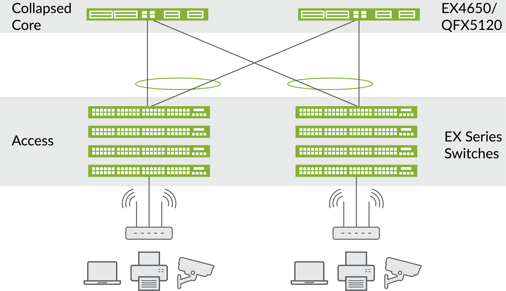

# Ansible Campus Collapsed Core

[](https://www.juniper.net/documentation/solutions/en_US/campus)

[](https://travis-ci.com/packetferret/Ansible-Campus-Collapsed-Core)

## Overview

`Ansible-Campus-Collapsed-Core` is an easier way to deploy a campus network based on a Collapsed Core design.

This project is based on *[Infrastructure-As-Code](https://dev.to/fedekau/infrastructure-as-code-a-beginners-perspective-2l8k)* concepts, where all elements of a device's configuration as stored in a format of `key:value` pairs and stored in a source-code management system such as Github or Gitlab. While not required for successful deployments, we at Juniper encourage network devops teams to *[leverage best practicies with git](https://dev.to/bholmesdev/git-github-best-practices-for-teams-opinionated-28h7)*.

The network designs available for you here are based upon *[Juniper's Validated Solutions](https://www.juniper.net/documentation/solutions/en_US/campus)*, feel free to take moment to review the *[Collapsed Core with EVPN Multihoming](https://www.juniper.net/documentation/en_US/release-independent/nce/information-products/pathway-pages/nce/nce-182-evpn-collapsed-core-evpn-multihoming-campus-pwp.html)*, *[EVPN-VXLAN Fabric](https://www.juniper.net/documentation/en_US/release-independent/nce/information-products/pathway-pages/nce/nce-172-evpn-vxlan-campus.html)*, and *[IP Clos](https://www.juniper.net/documentation/en_US/release-independent/nce/information-products/pathway-pages/nce/nce-203-campus-segmentation-ip-clos-pwp.html)* architectures.

## How to use this project

The crux of this project is to build the device configurations locally by executing the *[files/ansible/pb.configuration.build.yml](files/ansible/pb.configuration.build.yml)* playbook and applying the generated configurations with the *[files/ansible/pb.configuration.apply.yml](files/ansible/pb.configuration.apply.yml)* playbook; both playbooks are found in the `files/ansible` directory. Taking a peek at this relatively simple workflow, we can see that there are just five tasks executed:

>1. validate that Ansible is running at least version 2.7.8
>2. remove and rebuild local directories that hold our generated configurations
>3. build files to host the various stanzas of a Juniper configuration
>4. assemble all stanza files into a full device configuration
>5. push the configuration to the networking device

## New Features

- `Makefile` included to shortcut many of the commands
- Docker container provided for those that want execute in an isolated environment.
- EVE-NG lab for importing my toplogy has been added in `files/eve-ng_lab`

## Topology

Here is a high level perspective of what the playbook will build without any adjustments made to the yaml files stored within the respective `group_vars` and `host_vars` directories

### Collapsed Core EVPN Multihoming Diagram

[](files/images/Collapsed-Core.png)

### Connection Mappings

|            | xe-0/0/0   | xe-0/0/1   | xe-0/0/2   | xe-0/0/3 | xe-0/0/10 | xe-0/0/11 | em0 |
|------------|------------|------------|------------|----------|-----------|-----------|-----|
| core-sw1   | access-sw1 | access-sw2 | access-sw3 |          | core-sw2  | core-sw2  | oob |
| core-sw2   | access-sw1 | access-sw2 | access-sw3 |          | core-sw1  | core-sw1  | oob |
| access-sw1 | core-sw1   | core-sw2   | mist-ap1   | mist-ap2 |           |           | oob |
| access-sw2 | core-sw1   | core-sw2   | mist-ap3   | mist-ap4 |           |           | oob |
| access-sw3 | core-sw1   | core-sw2   | mist-ap5   | mist-ap6 |           |           | oob |

### L2 Interface Configurations

|            | xe-0/0/0 | xe-0/0/1 | xe-0/0/2 | xe-0/0/3 |
|------------|----------|----------|----------|----------|
| core-sw1   | Trunk    | Trunk    | Trunk    |          |
| core-sw2   | Trunk    | Trunk    | Trunk    |          |
| access-sw1 | Trunk    | Trunk    | Trunk    | vlan 1   |
| access-sw2 | Trunk    | Trunk    | Trunk    | vlan 2   |
| access-sw3 | Trunk    | Trunk    | Trunk    | vlan 3   |

### L3 Interface Configurations

|            | lo0.0      | irb.1    | irb.2    | irb.3    | xe-0/0/10 | xe-0/0/11 | em0        |
|------------|------------|----------|----------|----------|-----------|-----------|------------|
| core-sw1   | 172.20.0.1 | 10.0.1.3 | 10.0.2.3 | 10.0.3.3 | 10.99.0.0 | 10.99.0.2 | 10.6.5.111 |
| core-sw2   | 172.20.0.2 | 10.0.1.2 | 10.0.1.2 | 10.0.1.3 | 10.99.0.1 | 10.99.0.3 | 10.6.5.112 |
| access-sw1 |            |          |          |          |           |           | 10.6.5.113 |
| access-sw2 |            |          |          |          |           |           | 10.6.5.114 |
| access-sw3 |            |          |          |          |           |           | 10.6.5.115 |

## How to execute this playbook

The execution of this playbook can be acheived in multiple ways, experiment with each to find out your organization's preference. As you will see throughout the documentation, we have provided a `Makefile` to act as a shortcut for many of our project's commands.

### Running inside a Docker container

This is a personal preference, but this is a very clean method to run the playbook as it already manages all of your Python package dependencies. Within the root directory of this project, you will run two commands to build and run the dedicated docker container.

#### Building the Ansible container

This command will build the container image to be used by ansible

```sh
make build
```

> *note: the `make build` command only needs to be run once; subsequent executions of the command will not hurt anything, but will add a second or two of wasted time*

#### Building the configurations only (no apply)

If you would only like to build the configurations to your local machine, and hold off on applying them to your live networking devices, run this command:

```sh
make config
```

#### Building the configuration and applying it to the devices

If, instead, you would like to generate the configuraitons *AND* apply them to the live networking devices, run this command.

```sh
make ansible
```

## Deep Dive on *HOW* this playbook works

For those that are interested in pulling this playbook apart, I have added the following descriptions to detail exactly how the playbook works:

### Roles used within this playbook

This project is highly modular and will allow you adjust as needed to accomplish any design goal. For instance, if you wanted to use OSPF instead of BGP as the underlay, there is nothing that would stop you from updating the `protocols.yml` files to support that functionality. Because of this modularity, I felt it best to put all of the functionality of compiling these configurations within seperate roles, and then we can declare which types of devices should run through with roles (i.e. Firewalls should get the `security` stanza, but not data center switches)

> for the uninitiated, roles are found in the `roles/` directory of a project, and in our project, that directory will be `files/ansible/roles/`

Here is a quick breakdown of the formatting of roles used within this playbook:

#### build_config_stanza roles

As you will see during the playbook's execution, each device will have every configuration stanza generated as a seperate, temporary file. The creation of these files is the result of our roles that start with the name `juniper_stanza_`

Note that each one of these roles has a task in the `tasks/main.yml` file, and a templating file as `template/stanza_name.j2`. The former references the latter to produce a stanza of configuration, to be stored in the set of temporary directories `/tmp/ansible/{{ inventory_hostname }}/tmp`

#### assemble_config role

This will be the role that compiles each individual stanza into a single, cohesive configuration. Unfortunately, we have to prepend an integer to the left side of the file name to force Ansible's module to load them in the correct sequence.

A little ugly, but happy with the result.

#### push_config roles

This small subset of roles allows for the checking, diff'ing, and application of configurations to the devices live on the network. Currently these are disabled, allowing the playbook to merely render the configuration.

If you'd like to apply the configurations to the devices at run time, then make sure all of the IP addresses and hostnames are correct in your `inventory.yml` file, or dynamic inventory source of truth (i.e. Netbox), and uncomment out these three roles in the main playbook `pb.configuration.network.yml` file.

#### jsnapy roles

These are roles that will help you perform network validation on the status of your VXLAN/EVPN enabled campus. Purely focused on validation operational state, but infinetly helpful in your day-to-day operations.

#### localhost-build-dirs role

This role manages the local directories on your workstation. It will remove the previous `config/` directory and make sure an empty one replaces it before storing the completed/assembled configurations within it.

> Look in `config/` directory after your playbook is executed, this is where your assembled configurations are stored.

## Project dependencies

You may not be surprised to learn that you'll need Docker installed on your local workstation. That's it!

*[Docker](https://docs.docker.com/get-docker/)*

This requirement is an obvious moot point if you're using Ansible Tower to execute through a GUI.

### Optional

Protect your `secrets.yml` file by *[using Ansible-Vault to encrypt it with a password](https://docs.ansible.com/ansible/latest/user_guide/vault.html)*.

`ansible-vault encrypt group_vars/all/secrets.yml`

## Development

Want to contribute? Great!

Submit a PR and let's work on this together :D
